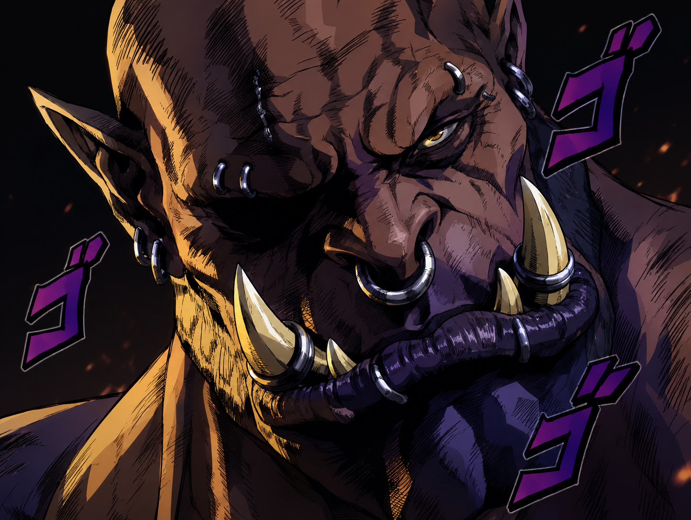

# Times Change

Midnight added a lot of exciting new cinematics. This addon respectfully replaces them with Warlords of Draenor.

No settings. No choices. Times change.

## Features

- Replaces known Midnight movies with the Warlords of Draenor opening cinematic.
- Replaces cancellable live cutscenes while you are in Midnight regions.
- Leaves non-Midnight cinematics and uncancellable vehicle or camera sequences untouched.
- Uses Blizzard's built-in movie, so no video files are bundled or downloaded by the addon.
- Falls back safely when the replacement movie is unavailable.

## Installation

1. Copy the `TimesChange` folder into `_retail_/Interface/AddOns/`.
2. Enable **Times Change** in the character-selection AddOns menu.
3. Enter Azeroth and accept that history is about to repeat itself.

## Configuration

There is none. Disable the addon from the character-selection AddOns menu if the timeline becomes too powerful.

## Compatibility

Built for World of Warcraft Retail 12.1.
